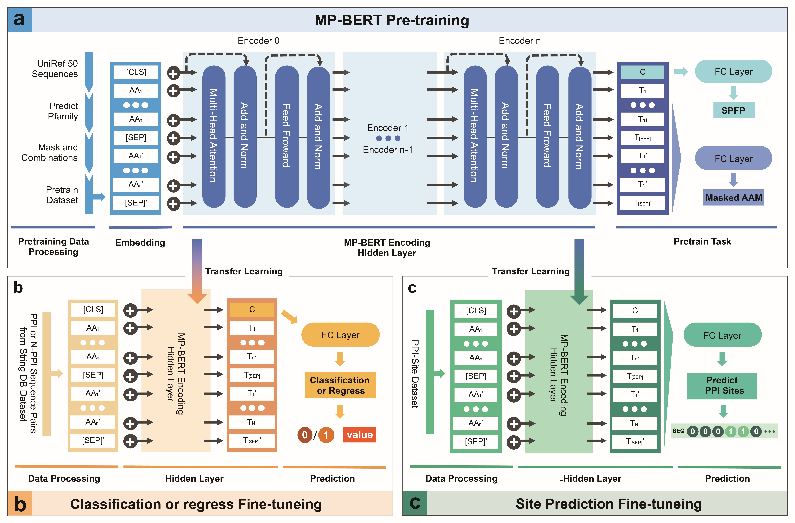

# MindSpore Protein BERT

## Install Requirements
### Huawei Atlas Server (Linux, with Huawei Ascend 910 NPU)
 

To run MP-BERT at Ascend using the MindSpore framework, it is recommended to use Docker, an open source application container engine that allows developers to package their applications, as well as dependency packages, into a lightweight, portable container.  By using Docker, rapid deployment of MindSpore can be achieved and isolated from the system environment.

Download Ascend traning base image for MindSpore framework from ascendhub:  
https://ascendhub.huawei.com/public-ascendhub/mindspore-modelzoo#/detail/ascend-mindspore

Note: Ascend and CANN firmware and drivers need to be installed in advance before installation. 
Confirm installation of ARM-based Ubuntu 18.04/CentOS 7.6 64-bit operating system.

### Nvidia GPU Server (Linux)
Linux server with GPU
Support for docker, conda and pip installation environments, see: 
https://www.mindspore.cn/install

### CPU Device (Linux and Windows)
Pre-training of MP-BERT is not supported using the CPU and fine-tuning of training on large datasets is not recommended. predictions calculated by the CPU are recommended to be installed using conda or pip: 
https://www.mindspore.cn/install

## Structure of MP-BERT and Finetune Task
MP-BERT is trained using publicly available unlabelled pure sequence protein sequences, by self-supervised learning in Figure a. 
We train and provide several different pre-trained models with different MP-BERT Hidden Layer sizes, different training data and different data compositions.
A fine-tuned framework for classification, regression and sitess prediction is currently available, as shown in Figures b and c.

